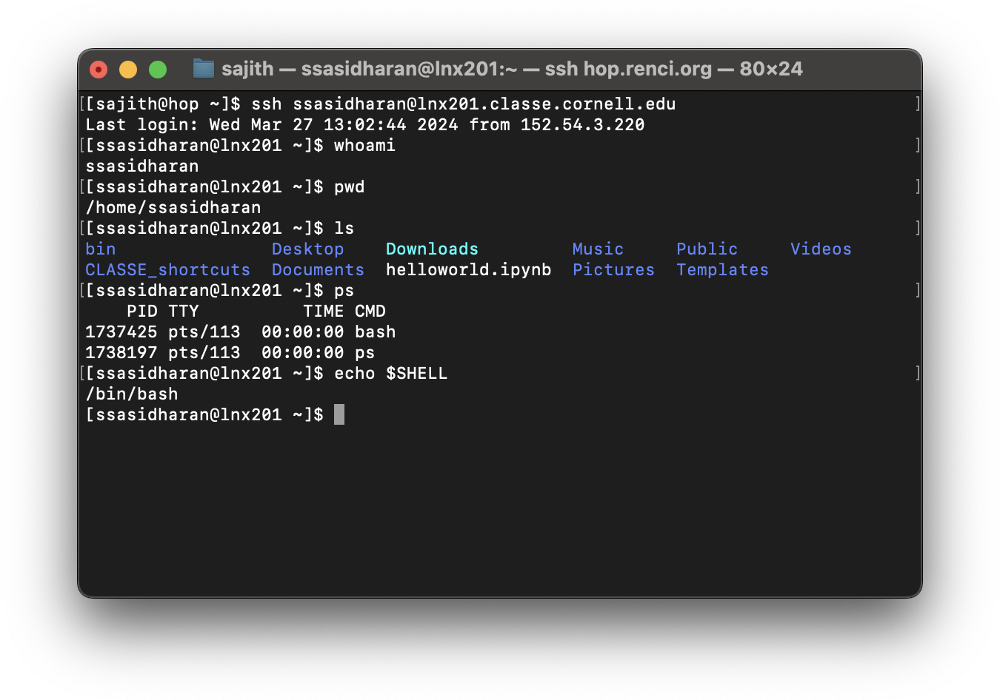

# Linux, Commandline, and Scripting

## Some words about Linux


## Some words about command line


## The shell

A shell is an interactive program that accepts commands and passes
those commands to the operating systems to execute.

In the shell, you type a command, hit enter, and the command gets
executed.  Shell is the program that is responsible for accepting your
commands, executing them, and printing the results on a console.

The screenshot below shows a how this works in practice: using a
terminal program, I'm using `ssh` command to access the host
`lnx201.classe.cornell.edu` (just `lnx201` henceforth), and then I'm
running some commands on `lnx201`.



Nearly all Linux distributions ship a shell named `bash`.  In the
`lnx201` environment that you access, `bash` is the default shell. You
will be staring at a bash prompt when you ssh to `lnx201`.

Although `bash` is the most popular shell, many other shells exist
too: `csh`, `ksh`, `dash`, `zsh`, and so on.  But let us not get
distracted and just commit to `bash` for now.


## Useful shell builtins

TODO: probably don't have to talk about this now?


# Directory navigation

Linux organizes directories and files in a _hierarchical directory
structure_, meaning, they are organized in a tree-like pattern.


- TODO: files, directories

## Directory structure

The first, or top-level directory of this tree is a special directory,
called the "root directory", or `/`.  All other directories are under
the root directory.  You can list things under `/` with the command
`ls /`:

```console
[user@lnx201 ~]$ ls /
bin   cdat  cvmfs  etc   lib    media  mnt  nfs   opt   root  sbin  sys  usr
boot  cifs  dev    home  lib64  misc   net  null  proc  run   srv   tmp  var
```

It is useful to know about some of these directories:

- `home` is where user home directories are.
  - `root` is the home directory for `root` user, aka superuser.
- `bin` and `sbib` are for programs.
- `lib` and `lib64` are for libraries.
- `etc` is for configuration files.
- `tmp` is for temporary files
- `proc` provides an interface with processes.


## The current working directory

At any time in the shell, we are "inside" a single directory, known as
the current working directory.  When you list files with `ls`, a list
of files and directories of the current working directory will be
printed on the output.

When you log in to `lnx201`, initially you will be in a directory
named `/home/${USER}`, where `${USER}` is your username on `lnx201`.
This is what is known as your /home directory/.  When you log in
first, your home directory will be your current working directory. 

To find where you are, use the command `pwd`.

The below commands are useful:

- `mkdir test` will create a directory named `test`
- `cd test` will change the working directory to `test`.
- `ls` will list files and directories in the current working
  directory.
- `rm` will remove a file.
- `rm <name of directory>` will _not_ remove a directory; you have to
  remove it _recursively_, like so: `rm -r <name of directory>`.
  

`cd -` is useful: it will switch you to the directory that you were
  previously in.
  
`.` and `..` are special directory names: `.` means the current
directory, and `..` means its parent directory, or the directory above
it in the directory hierarchy.
 
`touch` command is used to change file timestamps.  You can also use
`touch` to create an empty file, like so: `touch test.txt`.

- TODO: directory navigation: ls, cd, mkdir, rm, ln, pwd, touch


## Users and groups


## Permissions and ownership

- chmod, chown


## Symbolic links


## Pipes, job control

- pipes
- redirection (> and <)
- background and foreground processes
- listing processes (ps, top, htop)
- signals
- terminating processes (kill)


## Environment variables

- What are they?
- How to use them?


## Basic UNIX tools

- echo

- cat
- tail

- head
- tail

- sed
- awk
- grep
- sleep

- ping
- netstat

- ifconfig
- ip

- ps
- top
- htop
- kill
- killall

- hostname
- uname


- date
- cal

- clear
- history

- ssh
- scp
- sftp
- ftp
- wget
- curl

- ?

## Aliases


## Dotfiles


## Editors


## Writing shell scripts

- shebangs
- functions
- making files executable
- ~/.local/bin maybe?


## Nifty: terminal multiplexers


## Finding help and documentation

- finding help: man, info, the web


## Further reading

- https://missing.csail.mit.edu/2020/shell-tools/
