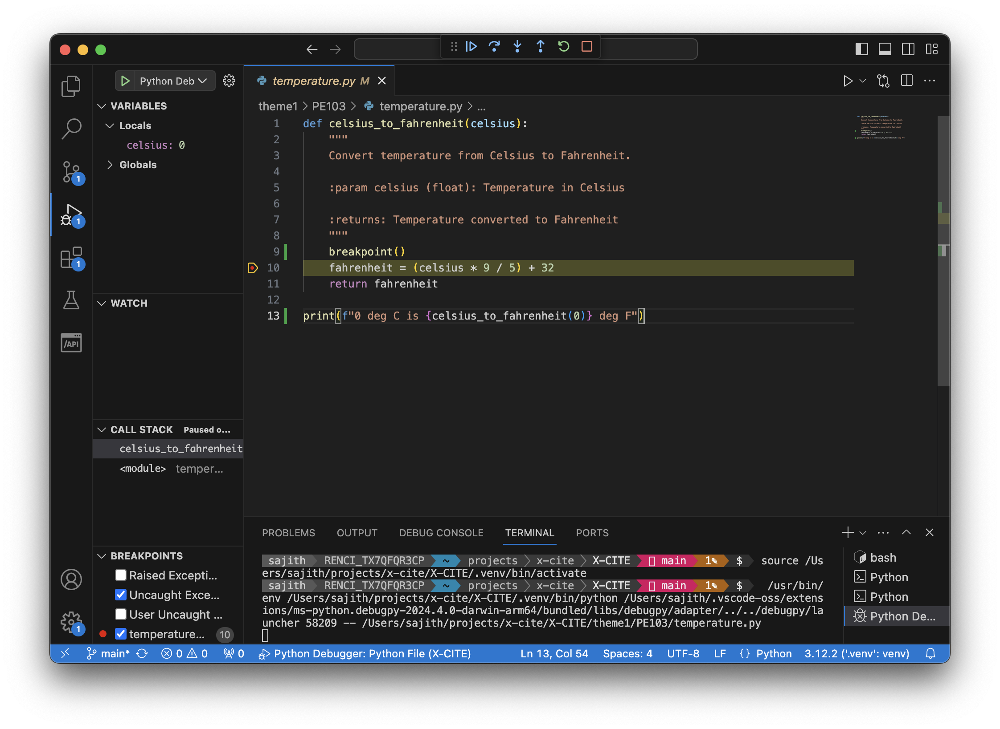
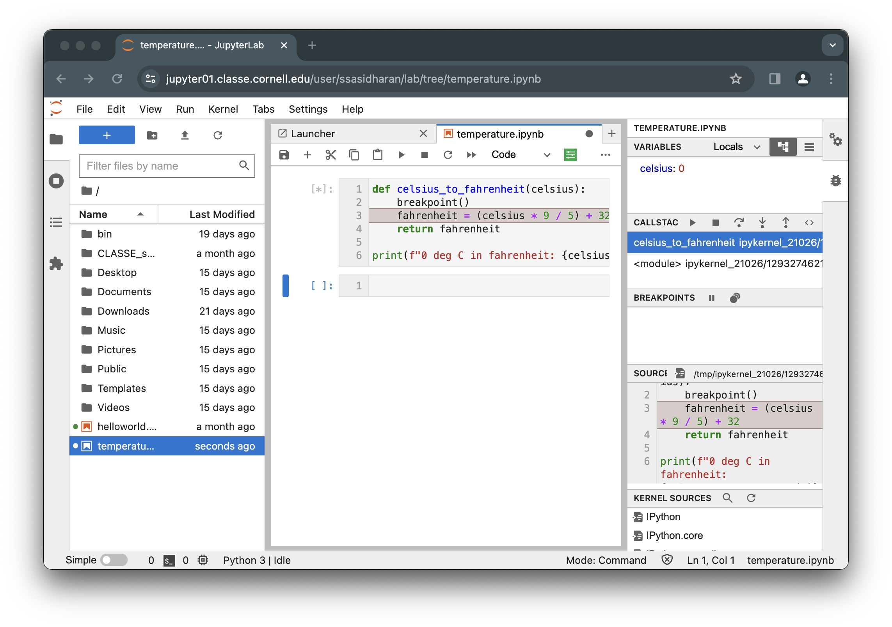

# Debugging

Debugging is the process of finding errors, unexpected behavior, or
performance issues, and fixing them.

There are many ways of doing this:

## Using print statements

You will want to add `print()` statements at various points in your
code, to help you understand the flow of execution and understand
where issues occur:

```{.python}
def celsius_to_fahrenheit(celsius):
    print(f"input in deg C: {celsius}")
    fahrenheit = (celsius * 9 / 5) + 32

    print(f"output in deg F: {fahrenheit}")
    return fahrenheit
```

## Using logging

Python standard library provides a [logging] module, which you can use
to log various events in your code.  One benefit of using `logging` is
that your application's logs can include log messages from the
libraries you use, so you will have more information to work with.

[logging]: https://docs.python.org/3/library/logging.html

You can set up your module to log its actions like so:

```{.python filename=temperature.py}
import logging
logger = logging.getLogger(__name__)

def celsius_to_fahrenheit(celsius):
    logger.info(f"input in deg C: {celsius}")
    fahrenheit = (celsius * 9 / 5) + 32

    logger.info(f"output in deg F: {fahrenheit}")
    return fahrenheit
```

And you should do some setup of `logging` module in your `main`
method:

```{.python filename=main.py}
import logging
from temperature import celsius_to_fahrenheit
logger = logging.getLogger(__name__)

def main():
    logging.basicConfig(filename="temperature.log", level=logging.INFO)
    logger.info("Started")
    celsius_to_fahrenheit()
    logger.info("Finished")

if __name__ == "__main__":
    main()
```

## Using the `pdb` module

Python standard library has a [`pdb`][pdb] module, which provides an
interactive debugging tool.

[pdb]: https://docs.python.org/3/library/pdb.html

The typical usage to break into the debugger is to insert an `import
pdb; pdb.set_trace()` line into your code:

```{.python filename=temperature-pdb.py}
import pdb; pdb.set_trace()

def celsius_to_fahrenheit(celsius):
    fahrenheit = (celsius * 9 / 5) + 32
    return fahrenheit

print(f"0 deg C in fahrenheit: {celsius_to_fahrenheit(0)}")
```

Now you can run the code like so, and use various `pdb` commands such
as `print` (to print the value and `step` and `next`:

```{.bash}
$ python3 temp-pdb.py
> /home/sajith/projects/x-cite/X-CITE/theme1/PE103/temp-pdb.py(3)<module>()
-> def celsius_to_fahrenheit(celsius):
(Pdb) help

Documented commands (type help <topic>):
========================================
EOF    c          d        h         list      q        rv       undisplay
a      cl         debug    help      ll        quit     s        unt
alias  clear      disable  ignore    longlist  r        source   until
args   commands   display  interact  n         restart  step     up
b      condition  down     j         next      return   tbreak   w
break  cont       enable   jump      p         retval   u        whatis
bt     continue   exit     l         pp        run      unalias  where

Miscellaneous help topics:
==========================
exec  pdb

(Pdb) next
> /home/sajith/projects/x-cite/X-CITE/theme1/PE103/temp-pdb.py(7)<module>()
-> print(f"0 deg C in fahrenheit: {celsius_to_fahrenheit(0)}")
(Pdb) step
--Call--
> /home/sajith/projects/x-cite/X-CITE/theme1/PE103/temp-pdb.py(3)celsius_to_fahrenheit()
-> def celsius_to_fahrenheit(celsius):
(Pdb) p celsius
0
(Pdb) next
> /home/sajith/projects/x-cite/X-CITE/theme1/PE103/temp-pdb.py(4)celsius_to_fahrenheit()
-> fahrenheit = (celsius * 9 / 5) + 32
(Pdb) next
> /home/sajith/projects/x-cite/X-CITE/theme1/PE103/temp-pdb.py(5)celsius_to_fahrenheit()
-> return fahrenheit
(Pdb) p fahrenheit
32.0
(Pdb) continue
0 deg C in fahrenheit: 32.0
```

Or you can insert a `breakpoint()` statement at the location you want
to break into the debugger:

```{.python filename=temperature-bp.py}
def celsius_to_fahrenheit(celsius):
    breakpoint()
    fahrenheit = (celsius * 9 / 5) + 32
    return fahrenheit

print(f"0 deg C in fahrenheit: {celsius_to_fahrenheit(0)}")
```

Now you can run the program, and step through the code following the
`breakpoint()`, and continue running without the debugger using the
`continue` command.

## Using unit tests

It is much easier to debug code when you have tests.  The tests you
write should help you test individual components of your code, and
isolate points of failures.  You can use a combination of
`print()` statements, logging, and `pdb`.

See [Testing](./testing.md) for some examples.


## Using IDEs

IDEs such as PyCharm and VS Code have built-in debugging facilities.



JupyterLab also has a built-in debugger:


