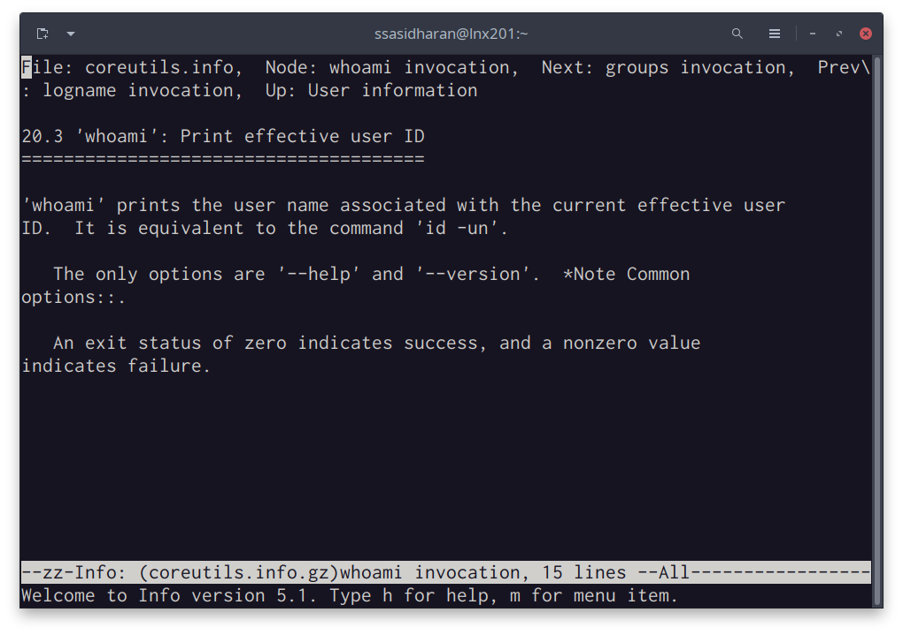

# Linux, Command Line, and Scripting

The following notes assume that you are all set up to use your
accounts on the CLASSE Linux systems.

- You know how to use `ssh` to access `lnx201.classe.cornell.edu`
  (just `lnx201` henceforth); or
- You know how to launch a terminal from [CLASSE JupyterLab
  instance][jupyerlab]; or
- You know how to use [NoMachine][nomachine] to access `lnx201`.

Depending on your level of familiarity with the system, you might know
enough commands to find your way around.  Since it probably is not a
good idea to make such assumptions right off the bat, let us see what
you might need to know to in order to become a proficient user of the
systems.


::: {.callout-note}

Slides accompanying these notes are available in [HTML][html-slides]
and [PDF][pdf-slides] formats.

[html-slides]: commandline-slides.html
[pdf-slides]: commandline-slides.pdf

:::

## Linux

Linux is a free and open source operating system known for stability,
security, and versatility.  Linux runs on a variety of machines from
small embedded systems to powerful servers. A great deal of software
runs on Linux.

You probably know all this already, so let us skip ahead.


## The command line

To perform certain kinds of tasks, using the command line is often
quicker and more efficient.  You can "chain" or compose separate
programs together, each of them specializing in doing different
things.  You can save longer tasks in the form of scripts for later
use, and share them with your colleagues.

Here's a quick example. You will find documentation for the software
installed on `lnx201` in the directory `/usr/share/doc`.  Many of
those are named `README`, or `README.md`, or `README.rst`, or
`readme.txt`, or some such variation. How many such files are there in
`/usr/share/doc`?

We can find that out by using [find] (a program for searching for
files under a directory tree) and [wc] (a word count program):

```{.bash}
[ssasidharan@lnx201 ~]$ find /usr/share/doc/ -iname "readme*" | wc -l
1589
```

Many of the files in `/usr/share/doc` mention the word "license" or
"LICENSE" or some variation thereof.  How many such lines are there?
In order to find that out, we can use [grep] (a program that matches
patterns), and `wc` together:

```{.bash}
[ssasidharan@lnx201 ~]$ grep -ir license /usr/share/doc/ | wc -l
84089
```

Learning to use the command line well will leave more power on your
hands.

[find]: https://www.man7.org/linux/man-pages/man1/find.1.html
[wc]: https://man7.org/linux/man-pages/man1/wc.1.html
[grep]: https://www.man7.org/linux/man-pages/man1/grep.1.html


# The shell

A shell is an interactive program that accepts commands and passes
those commands to the operating systems to execute.

In the shell, you type a command, hit enter, and the command gets
executed.  Shell is the program that is responsible for accepting your
commands, executing them, and printing the results on a console.

Nearly all Linux distributions ship a shell named [bash].  In the
`lnx201` environment that you access, `bash` is the default shell. You
will be staring at a bash prompt when you ssh to `lnx201`.

The screenshots below shows a how this works in practice.

Using a terminal program, I'm using `ssh` command to access `lnx201`,
and then I'm running some commands on `lnx201`.


Or you can use CLASSE's [JupyerLab], and then can launch a terminal
(from File > New > Terminal from the menu, or the "Terminal" icon on
the launcher):


Or you might be accessing CLASSE [NoMachine], either with a client or
with a web browser.  You can launch a terminal from the desktop menu:


Although `bash` is the most popular shell, many other shells exist
too: `csh`, `ksh`, `dash`, `zsh`, and so on.  But let us not get
distracted and just commit to `bash` for now.

[bash]: https://en.wikipedia.org/wiki/Bash_(Unix_shell)
[JupyerLab]: https://jupyter01.classe.cornell.edu/
[NoMachine]: https://wiki.classe.cornell.edu/Computing/NoMachine
[NoMachine-web]: https://nomachine.classe.cornell.edu/

## Using the shell prompt

The `[ssasidharan@lnx201 ~]$ ` thing with a blinking cursor at the end
is called a _shell prompt_.  You type commands at the shell prompt,
hit enter, and then something happens in response to that.

The examples in these notes are _my_ shell prompt: it contains my
username on `lnx201`, followed by `@` character, followed by the name
of the computer (or "hostname"), followed by the current directory.
Your prompt will be different, because it will contain your username.

After entering the first few characters of a command, you can use the
 key for auto-completing commands.

```{.bash}
[ssasidharan@lnx201 /]$ ssh<tab>
ssh          ssh-agent    sshd         sshfs        ssh-keyscan  
ssh-add      ssh-copy-id  sshd-keygen  ssh-keygen   sshpass   
[ssasidharan@lnx201 /]$ condor_<tab>
Display all 119 possibilities? (y or n)
```

Bash offers some helpful methods for editing and navigating the
history of commands you have previously executed.

- You can use up/down arrow keys to navigate history.
- `history` command will print a list of recently used commands.
- You can use  to search command history.
-  will make the cursor to the beginning of the line.
-  will go to the end of the line.
-  will "kill" (cut) text from current position to end
  of line to a buffer called the "kill-ring".
-  will "yank" (paste) most recently killed text from
  the kill ring to current cursor position.
-  will cycle through the kill-ring.


To exit the shell, you can use `exit` command or .  

If you are using ssh to connect to `lnx201`, exiting the shell will
end your ssh session.  If you had opened a terminal window, exiting
the shell will close the window.

# Finding help

On the topics covered here in these notes, there is a wealth of
information out there: in the form of books, articles, videos,
courses, and so on.

You can also find some built-in documentation in the system itself.

Often you can find help for the programs that you run by passing
`--help` argument to them.  For example:

```{.bash}
[ssasidharan@lnx201 ~]$ whoami --help
Usage: whoami [OPTION]...
Print the user name associated with the current effective user ID.
Same as id -un.

      --help     display this help and exit
      --version  output version information and exit

GNU coreutils online help: <http://www.gnu.org/software/coreutils/>
For complete documentation, run: info coreutils 'whoami invocation'
```

As the above text suggests, another way to find manuals is by running
the command `info`.  Below is the result of running `info coreutils
'whoami invocation'` as the above example suggests:



The `info` program runs a text-based documentation browser.  You can
move the cursor using tab or arrow keys, and use enter key to follow
the links.  A lot of the essential software on Linux, including
`bash`, is made by [GNU project][gnu], and info is their choice of
documenting software.

[gnu]: http://gnu.org/

A lot of the other software has Unix roots, and their documentation
tend to be in the form of `man` (short for "manual") pages.  You can
run `man <program-name>` to read those.  Running `man ssh` will
display `ssh` program's `man` page.

Man pages are divided into several sections: try running `man man` to
find out what they are.

You can run `man -k <pattern>` or `apropos <pattern>` to search man
pages, and it will print a list of manual pages that contains the
matching pattern.

Yet another place to look for documentation is the folder
`/usr/share/doc`, where some additional documentation for software
packages installed in the system are available.


# Environment variables

During a session, the shell maintains some information in what is
known as _environment variables_.  They are key-value pairs: programs
can look up values by keys, and use that information.

To list the environment variables present in your session, use
`printenv` command:

```{.bash}
[ssasidharan@lnx201 ~]$ printenv
HOSTNAME=lnx201.classe.cornell.edu
TERM=xterm-256color
SHELL=/bin/bash
HISTSIZE=1000
SSH_CLIENT=152.54.3.220 50338 22
SSH_TTY=/dev/pts/6
USER=ssasidharan
MAIL=/var/spool/mail/ssasidharan
PATH=/usr/lib64/qt-3.3/bin:/usr/local/bin:/usr/bin:/usr/local/sbin:/usr/sbin:/opt/puppetlabs/bin:/home/ssasidharan/bin
PWD=/home/ssasidharan
LANG=en_US.UTF-8
HOME=/home/ssasidharan
```

This omits some lines for the sake of brevity, but you get the idea.

Some of these environment variables are worth knowing:

- `USER` is your username on `lnx201`.
- `HOME` is your "home" directory on `lnx201`.  This is where you keep your files and folders.
- `SHELL` is the shell you use currently.
- `PATH` is a list of directory names, separated by `:` (colon)
  character.  When you enter a command on the shell prompt, the shell
  will search directories in `PATH` to locate the program that it
  needs to run.

To print an individual environment variable, use [echo] command:

```{.bash}
[ssasidharan@lnx201 /]$ echo $PATH
/usr/lib64/qt-3.3/bin:/usr/local/bin:/usr/bin:/usr/local/sbin:/usr/sbin:/opt/puppetlabs/bin:/home/ssasidharan/bin
```

The `$` prefix tells `echo` that `PATH` is an environment variable.
Without the `$` prefix, `echo PATH` will simply print the string
`PATH`.

[echo]: https://www.man7.org/linux/man-pages/man1/echo.1.html


## How does bash set up the environment?

There are two kinds of shell sessions: login and non-login.  login
session starts when you enter a username and password, such as when
using `ssh`. A non-login session starts when you open a terminal
window from a desktop.

Depending on how the session was started, a few shell scripts are read
and executed when starting a shell.

For login shells these will be:

- `/etc/profile` is a global script that applies to all users.  
- `~/.bash_profile` is a script in your home directory, and it is
applied when you start a shell.
- If `~/.bash_profile` was not found, bash will attempt to read
  `~/.bash_login` and `~/.profile` in order.

For non-login shells:

- `/etc/bashrc` is the script that applies to everyone.
- `~/.bashrc` is the script that applies to you.

Non-login shells also inherit the environment from their parent
process, which is usually a login shell.

Systems vary on how they are set up. You should look around `lnx201`
to find out how this is done there. These files are some examples of
shell scripts, which is a topic we'll visit later in these notes.

## Changing environment variables

You can also use `export` command to overwrite existing environment
variables, or add new ones.  For example:

```{.bash}
[ssasidharan@lnx201 /]$ export HISTSIZE=2000
[ssasidharan@lnx201 /]$ echo $HISTSIZE
2000
```

Note that this change in `HISTSIZE` applies only to the current shell.
It will be forgotten when you exit the shell.  

In order to make the change permanent, you will need to add the line
`export HISTSIZE=2000` to your `~/.bash_profile` file.


# Directory navigation

Linux organizes directories and files in a _hierarchical directory
structure_, meaning, they are organized in a tree-like pattern.

The first, or top-level directory of this tree is a special directory,
called the "root directory", or `/`.  All other directories are under
the root directory.  You can list things under `/` with the command
`ls /`:

```{.bash}
[sasidharan@lnx201 ~]$ ls /
bin   cdat  cvmfs  etc   lib    media  mnt  nfs   opt   root  sbin  sys  usr
boot  cifs  dev    home  lib64  misc   net  null  proc  run   srv   tmp  var
```

It is useful to know about some of these directories:

- `/home` is where user home directories are.
- `/root` is the home directory for `root` user, aka superuser.
- `/bin` is for programs that are available to everyone.
- `/sbin` is for programs available to the `root` user.
- `/lib` and `/lib64` are for libraries.
- `/etc` is for configuration files.
- `/tmp` is for temporary files.
- `/proc` provides an interface with processes.
- `/usr` has been, historically, for "Unix System Resources", and
  contains several sub-directories:
  - `/usr/bin` and `/usr/sbin` are for programs.
  - `/usr/lib` is for libraries, typically used by programs in
    `/usr/bin` and `/usr/sbin`.
  - `/usr/include` is for C and C++ header files.
  - `/usr/share` contains data files used by programs, including
    documentation in `/usr/share/doc`.
  - Some Python programs are globally installed, and the Python
    library packages they use are in `/usr/lib/python{version}`.
  - `/usr/local` is for programs that are "locally" installed by a
    system administrator. (Meaning, it is for software that wasn't
    packaged by the operating system vendor.)

## Absolute and relative paths

Paths can be specified in two ways: absolute or relative.  An absolute
pathname begins with the root directory, `/`, and contains every
directory name, branch by branch.

Absolute path to the `Desktop` directory in my home directory on
`lnx201` is `/home/ssasidharan/Desktop/`.

In comparison, a relative pathname starts from the working directory.
When I'm in my home directory, I can simply use the relative pathname,
`Desktop`.

Every directory contains two special directory names, `.` and `..`, in
which `.` refers to the current directory, and `..`  refers to the
parent directory of the current directory.

```{.bash}
[ssasidharan@lnx201 ~]$ pwd
/home/ssasidharan
[ssasidharan@lnx201 ~]$ cd .
[ssasidharan@lnx201 ~]$ pwd
/home/ssasidharan
[ssasidharan@lnx201 ~]$ cd ..
[ssasidharan@lnx201 home]$ pwd
/home
[ssasidharan@lnx201 home]$ cd ..
[ssasidharan@lnx201 /]$ pwd
/
```

## Wildcards

The shell gives special treatment to some characters, known as
_wildcards_.  Using wildcard characters, we can quickly specify groups
of files.

The wildcard character `*` stands for any set of characters.  For
example, you can list the names of all programs in `/usr/bin` that
start with `ab` with `ls /usr/bin/ab*`:

```{.bash}
[ssasidharan@lnx201 ~]$ ls /usr/bin/ab*
/usr/bin/ab  /usr/bin/abs2rel
```

The wildcard character `?` stands for any single character.  So if you
want to list the filenames in `/usr/bin` that starts with any
character, followed by `abc`, followed by any characters:

```{.bash}
[ssasidharan@lnx201 ~]$ ls /usr/bin/?abc*
/usr/bin/kabc2mutt  /usr/bin/kabcclient
```

<!-- - use `*` carefully with `rm` -->


## The current working directory

At any time in the shell, we are "inside" a single directory, known as
the current working directory.  When you list files with `ls`, a list
of files and directories of the current working directory will be
printed on the output.

When you log in to `lnx201`, initially you will be in a directory
named `/home/${USER}`, where `${USER}` is your username on `lnx201`.
This is what is known as your /home directory/.  When you log in
first, your home directory will be your current working directory.

To find where you are, use the command `pwd`.

The below commands are useful:

- `mkdir test` will create a directory named `test`
- `cd test` will change the working directory to `test`.
- `ls` will list files and directories in the current working
  directory.
- `rm` will remove a file.
- `rm <name of directory>` will _not_ remove a directory; you have to
  remove it _recursively_, like so: `rm -r <name of directory>`.

`cd -` is useful: it will switch you to the directory that you were
  previously in:
  
```{.bash}
[ssasidharan@lnx201 /]$ cd /usr/
[ssasidharan@lnx201 usr]$ pwd
/usr
[ssasidharan@lnx201 usr]$ cd share/
[ssasidharan@lnx201 share]$ pwd
/usr/share
[ssasidharan@lnx201 share]$ cd -
/usr
[ssasidharan@lnx201 usr]$ pwd
/usr
```
  
Running `cd ~` (or simply `cd`) will drop you back in your home
directory:

```{.bash}
[ssasidharan@lnx201 ~]$ cd /usr/share/doc/
[ssasidharan@lnx201 doc]$ pwd
/usr/share/doc
[ssasidharan@lnx201 doc]$ cd ~
[ssasidharan@lnx201 ~]$ pwd
/home/ssasidharan
```

It is worth noting that the shell will substitute `~` for your home
directory.

`.` and `..` are special directory names: `.` means the current
directory, and `..` means its parent directory, or the directory above
it in the directory hierarchy.

`touch` command is used to change file timestamps.  You can also use
`touch` to create an empty file, like so: `touch test.txt`.

### Symbolic links

On my home directory on `lnx201`, when I do an `ls -l` (which is for
`ls` with long file listing format), I would see something like this:

```{.bash}
lrwxrwxrwx  1 ssasidharan chess   31 Mar 26 15:21 Downloads -> /cdat/tem/ssasidharan/Downloads
```

The first letter of the listing is `l` and the entry kind of suggests
that my `Downloads` directory is a reference to another directory,
`/cdat/tem/ssasidharan/Downloads`.  The `Downloads` directory in my
home directory is what is called a symbolic link, which also known as
a soft link or "symlink".

With symbolic links, we can have shortcuts to other files or
directories.

<!-- ### Creating empty files -->

<!-- touch -->


## Users and groups

Linux is a multi-user operating system.  Since many people can be
using the system, there needs to be mechanisms in place to ensure
separation between them, while ensuring that they can access shared
resources when necessary.

The basic mechanism is the concept of users and groups.

The root user is a special user that has all the permissions. They can
change most things about the system.  The root user can change system
configuration, add and remove users and groups, etc.

Most of the time, we do not need neither the power nor the
responsibilities of the root user.  So we have a non-root, _regular_
user account in `lnx201`.

Your account also belongs to certain _groups_. Groups are the way to
grant permission to a group of accounts.  You can find the groups you
belong to using `groups` command:

```{.bash}
[ssasidharan@lnx201 ~]$ groups
chess classeuser
[ssasidharan@lnx201 ~]$
```

Users and groups have distinct numerical identifiers too.  You can
find them with `id` command:

```{.bash}
[ssasidharan@lnx201 ~]$ id
uid=63499(ssasidharan) gid=262(chess) groups=262(chess),750(classeuser)
```

If you run `ls -l` (`-l` is for long listing format) command to list
files and folders in your home directory, the result will be something
like this:

```{.bash}
[ssasidharan@lnx201 ~]$ ls -l
total 4
drwxr-xr-x 2 ssasidharan chess   28 Mar 28 09:36 bin
drwxr-xr-x 2 ssasidharan chess  144 Mar 12 00:27 CLASSE_shortcuts
drwxr-xr-x 2 ssasidharan chess   30 Mar 26 15:22 Desktop
drwxr-xr-x 2 ssasidharan chess    6 Mar 26 15:21 Documents
lrwxrwxrwx 1 ssasidharan chess   31 Mar 26 15:21 Downloads -> /cdat/tem/ssasidharan/Downloads
-rw-r--r-- 1 ssasidharan chess 3254 Mar  7 15:55 helloworld.ipynb
drwxr-xr-x 2 ssasidharan chess    6 Mar 26 15:21 Music
drwxr-xr-x 2 ssasidharan chess    6 Mar 26 15:21 Pictures
drwxr-xr-x 2 ssasidharan chess    6 Mar 26 15:21 Public
drwxr-xr-x 2 ssasidharan chess    6 Mar 26 15:21 Templates
drwxr-xr-x 2 ssasidharan chess    6 Mar 26 15:21 Videos
```

Let us see what the above columns means:

- The first column lists permissions on the file/folder.  (We will see
  what this means in the next section.)
- The second column shows number of links to it.
- The third one shows the user who owns it.
- The fourth one shows the group that owns the file.
- The fifth one is the size of the file in bytes.  Note that
directories are a little special here -- what you see here is not the
total size of all the files and folders under the directory, but the
space the directory itself uses on disk.
- The next column (the whole `Mar 26 15:21` segment) shows a timestamp
  when the file/folder was last modified.
- Finally, the name of the file/folder.  Note that `Downloads ->
  /cdat/tem/ssasidharan/Downloads` is a bit special: it means that
  `Downloads` folder is in fact a link to
  `/cdat/tem/ssasidharan/Downloads`.


## Permissions and ownership

Let us see what a string like `drwxr-xr-x` from the above example
means.  This string, sometimes called "permission bits" or "file mode
bits", is ten characters long.  Each of the characters are shorthand
signifying something.

- The first `d` stands for `directory`.  (For files, this will be a `-`.)
- The next three `rwx` are for user's permissions.
- The next three `r-x` are for group permissions.
- The final three `r-x` are for permissions for the rest of the users.

Now, what do those `r` and `w` and `x` mean?

- `r` means permission to **r**ead.
- `w` means permission to **w**rite.
- `x` means permission to e**x**ecute, in the case of files.  In the
  case of directories, `x` means that you can `cd` into them.

### Changing permissions with `chmod`

You can use `chmod` command to change permissions.  If you create a
shell script named `test.sh`, for example, it won't be executable by
default.  You will have to change the file mode bits using `chmod`:

```{.bash}
[ssasidharan@lnx201 ~]$ ls -l test.sh
-rw-r--r-- 1 ssasidharan chess 0 Mar 28 13:39 test.sh
[ssasidharan@lnx201 ~]$ ./test.sh
-bash: ./test.sh: Permission denied
[ssasidharan@lnx201 ~]$ chmod +x test.sh
[ssasidharan@lnx201 ~]$ ls -l test.sh
-rwxr-xr-x 1 ssasidharan chess 0 Mar 28 13:39 test.sh
[ssasidharan@lnx201 ~]$ ./test.sh
```

You can remove the `x` bit like so:

```{.bash}
[ssasidharan@lnx201 ~]$ chmod -x test.sh
[ssasidharan@lnx201 ~]$ ls -l test.sh
-rw-r--r-- 1 ssasidharan chess 0 Mar 28 13:39 test.sh
```

You can also grant permission to just the **o**wner, or **g**roup, or others:

```{.bash}
[ssasidharan@lnx201 ~]$ chmod u+x test.sh
[ssasidharan@lnx201 ~]$ ls -l test.sh
-rwxr--r-- 1 ssasidharan chess 0 Mar 28 13:39 test.sh
[ssasidharan@lnx201 ~]$ chmod g+x test.sh
[ssasidharan@lnx201 ~]$ ls -l test.sh
-rwxr-xr-- 1 ssasidharan chess 0 Mar 28 13:39 test.sh
[ssasidharan@lnx201 ~]$ chmod o+x test.sh
[ssasidharan@lnx201 ~]$ ls -l test.sh
-rwxr-xr-x 1 ssasidharan chess 0 Mar 28 13:39 test.sh
```

You can also combine `u`, `g`, `o` bits and `r`, `w`, `x` bits with
`+` or `-`:

```{.bash}
[ssasidharan@lnx201 ~]$ chmod ugo-r test.sh
[ssasidharan@lnx201 ~]$ ls -l test.sh
--wx--x--x 1 ssasidharan chess 0 Mar 28 13:39 test.sh
```

I just made the file unreadable by everyone, even me!

```{.bash}
[ssasidharan@lnx201 ~]$ cat test.sh
cat: test.sh: Permission denied
```

Of course you can restore the permission with `chmod ugo+r test.sh`

Note that when invoking `chmod`, `a` (or **a**ll) is equivalent of
`ugo` (user + group + others).  You can also omit `a` or `ugo` if you
want everyone to have the same permissions.  So the below all are
equivalent:

```{.bash}
[ssasidharan@lnx201 ~]$ chmod ugo+r test.sh
[ssasidharan@lnx201 ~]$ chmod a+r test.sh
[ssasidharan@lnx201 ~]$ chmod +r test.sh
```

(If you want to change owner or group of a file/folder, you can do
that with `chown` and `chgrp`.  This probably is not immediately
useful; it is enough to know that these commands exist.)


## Noteworthy facts about file names

- File/folder names that begin with a `.` (period character) are
  "hidden": meaning that they will not be listed in the output of `ls`
  command by default.  You can list them with `ls -a`. They are also
  called _dotfiles_.

  Configuration files for the programs you use (such as `.bashrc` for
  bash configuration) are often saved in hidden files.  This way they
  usually stay out of your way without creating a clutter.

- File/folder names and commands are case sensitive in Linux.  Thus
  `Notes.txt` and `notes.txt` and `NOTES.TXT` are all distinct files.

- As a matter of convenience, it is better to avoid spaces and special
  characters in file/folder names, as it will make tasks a little more
  difficult. If you need to represent spaces between words, you can
  replace spaces with `_` (the underscore character).


# Standard input, output, and error

Nearly all programs produce output of some kind, and quite often they
also accept input.

Following the Unix tradition of "everything is a file", programs send
their output to special files called _standard output_ or _standard
error_, and they read input from _standard input_.  They are also
known as `stdout`, `stderr`, and `stdin`, respectively.


## I/O redirection

I/O redirection lets us to change where standard output gets printed.
To redirect standard output, we use the `>` operator.

```{.bash}
[ssasidharan@lnx201 ~]$ ls -l > ls-output.txt
```

As a result of redirection, a new file named `ls-output.txt` will be
created.  You can view its contents using `cat` command.

```{.bash}
[ssasidharan@lnx201 ~]$ ls -l ls-output.txt
-rw-r--r-- 1 ssasidharan chess 807 Apr  1 17:32 ls-output.txt
[ssasidharan@lnx201 ~]$ cat ls-output.txt
total 4
drwxr-xr-x 2 ssasidharan chess   28 Mar 28 09:36 bin
drwxr-xr-x 2 ssasidharan chess  144 Mar 12 00:27 CLASSE_shortcuts
drwxr-xr-x 2 ssasidharan chess   30 Mar 26 15:22 Desktop
drwxr-xr-x 2 ssasidharan chess    6 Mar 26 15:21 Documents
lrwxrwxrwx 1 ssasidharan chess   31 Mar 26 15:21 Downloads -> /cdat/tem/ssasidharan/Downloads
-rw-r--r-- 1 ssasidharan chess 3254 Mar  7 15:55 helloworld.ipynb
-rw-r--r-- 1 ssasidharan chess    0 Apr  1 17:32 ls-output.txt
drwxr-xr-x 2 ssasidharan chess    6 Mar 26 15:21 Music
drwxr-xr-x 2 ssasidharan chess    6 Mar 26 15:21 Pictures
drwxr-xr-x 2 ssasidharan chess    6 Mar 26 15:21 Public
drwxr-xr-x 2 ssasidharan chess    6 Mar 26 15:21 Templates
-rwxr-xr-x 1 ssasidharan chess    0 Mar 28 13:39 test.sh
drwxr-xr-x 2 ssasidharan chess    6 Mar 26 15:21 Videos
```

Note that if there already was a file named `ls-output.txt`, the
redirection above would have overwritten its contents.  You want to be
careful about this.

What if you want to discard `stdout` completely?  You can redirect it
to the special file `/dev/null`:

```{.bash}
[ssasidharan@lnx201 ~]$ ls -l >> ls-output.txt
```

If you want to append `stdout` to a file instead of overwriting it,
you can use `>>` operator:

```{.bash}
[ssasidharan@lnx201 ~]$ ls -l >> ls-output.txt
```

The  `<` operator is a sort of inverse of the `>` operator:

```{.bash}
[ssasidharan@lnx201 ~]$ echo "Shall I compare thee to a summer’s day?" > sonnet18.txt
[ssasidharan@lnx201 ~]$ cat sonnet18.txt
Shall I compare thee to a summer’s day?
[ssasidharan@lnx201 ~]$ cat < sonnet18.txt
Shall I compare thee to a summer’s day?
```

<!-- (TODO: explain the above: `echo` and the different usage of `cat`.) -->


## Pipes

Programs can write to standard output.  Programs can also read from
standard input. This means we can "chain" them together, such that one
programs standard output is "piped" into another program's standard
input.

The operator to do this is `|` (vertical bar), also known as a pipe,
and it is used in this manner: `command1 | command2`.


```{.bash}
[ssasidharan@lnx201 ~]$ ls -l /bin/ | less
```

The output of `ls -l /bin` is fairly large, so we pipe it into `less`,
which allows you to scroll the output backward and forward, using _up_
and _down_ keyboard keys.

You can form longer pipes like this:

```{.bash}
[ssasidharan@lnx201 ~]$ ls /bin /usr/bin /sbin /usr/sbin | sort | uniq | wc
   4289    4288   46820
```

- `sort` will sort lines of text files.
- `uniq` is used to filter adjacent matching lines the output of
  `sort`.
- `wc` is a **w**ord **c**ount program.  It counts lines, words, and
  bytes present in its input.


# Controlling processes

When you run a command, it results in what is called a _process_.
Processes are running instances of programs which use CPU, memory, and
possibly other resources.

## Listing processes

You can list running processes using `ps` command:

```{.bash}
[ssasidharan@lnx201 ~]$ ps
    PID TTY          TIME CMD
 694411 pts/81   00:00:00 ps
3479688 pts/81   00:00:00 bash
```

By default, `ps` prints processes of the current user and terminal in
four columns:

- `PID` is process id.
- `TTY` is the terminal associated with the process.
- `TIME` is the elapsed CPU time for the process.
- `CMD` is the command that created the process.

Usually there are many more processes running in the system, and
sometimes they were started by other users.  You can list them, with
more detail, by passing some options to `ps`:

```{.bash}
[ssasidharan@lnx201 ~]$ ps -ef | head
UID          PID    PPID  C STIME TTY          TIME CMD
root           1       0  0 Jan10 ?        03:14:05 /usr/lib/systemd/systemd --switched-root --system --deserialize 22
root           2       0  0 Jan10 ?        00:01:12 [kthreadd]
root           6       2  0 Jan10 ?        00:12:16 [ksoftirqd/0]
root           7       2  0 Jan10 ?        00:01:10 [migration/0]
root           8       2  0 Jan10 ?        00:00:00 [rcu_bh]
root           9       2  0 Jan10 ?        11:14:26 [rcu_sched]
root          10       2  0 Jan10 ?        00:00:00 [lru-add-drain]
root          11       2  0 Jan10 ?        00:05:22 [watchdog/0]
root          12       2  0 Jan10 ?        00:00:24 [watchdog/1]
```

Run `man ps` for details.

Programs like `top` and `htop` will list processes in friendlier,
fancier format.


## Background and foreground processes

By default, commands run in the _foreground_: they do their thing, use
the terminal (to read input, print output), and finally exit.  You
need to wait for a foreground process to end before you start the next
one, or use another terminal.

When have a long-running process, you have the option of sending it to
the _background_, using the `&` operator:

```{.bash}
[ssasidharan@lnx201 ~]$ sleep 100 &
[1] 949751
```

You can use  to stop a foreground process and send it
to the background:

```{.bash}
[ssasidharan@lnx201 ~]$ sleep 100
^Z
[1]+  Stopped                 sleep 100
```

You can list background processes using `jobs` command:

```{.bash}
[ssasidharan@lnx201 ~]$ jobs
[1]-  Running                 sleep 100 &
[2]+  Stopped                 sleep 100
```

You can bring a background process to foreground using `fg` command,
and you can terminate it using :

```{.bash}
[ssasidharan@lnx201 ~]$ fg 2
sleep 100
^C
[ssasidharan@lnx201 ~]$
```

You can use `bg` command to resume a stopped background process:

```{.bash}
[ssasidharan@lnx201 ~]$ sleep 100 &
[1] 1746205
[ssasidharan@lnx201 ~]$ sleep 100
^Z
[2]+  Stopped                 sleep 100
[ssasidharan@lnx201 ~]$ jobs
[1]-  Running                 sleep 100 &
[2]+  Stopped                 sleep 100
[ssasidharan@lnx201 ~]$ bg %2
[2]+ sleep 100 &
```

## Terminating processes

Sometimes you might want to terminate a program, perhaps because it is
using too much CPU or memory. You can find out the offending program's
ID using `ps` or `top` or `htop`, and then you can use `kill` command
to end the process.

By default, `kill` sends a signal called `SIGTERM` (more on signals
later).  If `SIGTERM` is unable to terminate the process (such as when
the program is ignoring `SIGTERM`), you can try `SIGKILL`:

```{.bash}
[ssasidharan@lnx201 ~]$ ps
    PID TTY          TIME CMD
 796679 pts/116  00:00:00 bash
1185454 pts/116  00:00:00 ps
1748299 pts/116  00:00:00 sleep
[ssasidharan@lnx201 ~]$ kill 1748299
[ssasidharan@lnx201 ~]$ ps
    PID TTY          TIME CMD
 796679 pts/116  00:00:00 bash
1203470 pts/116  00:00:00 ps
1748299 pts/116  00:00:00 sleep
[ssasidharan@lnx201 ~]$ kill -SIGKILL 1748299
[2]+  Killed                  sleep 100
```

You can use `killall` command to kill processes by name:

```{.bash}
[ssasidharan@lnx201 ~]$ killall sleep
sleep(1469283): Operation not permitted
sleep(1509215): Operation not permitted
sleep: no process found
```

In the above example, you are not running a `sleep` process, but some
other users are, and you are not allowed to terminate them.


## Signals

As mentioned above, `kill` command sends _signals_ to running
processes, and we've already seen `SIGTERM` and `SIGKILL`.  Signals
are a process control mechanism. They are used to stop, resume, or
terminate processes, and more.

When we use  or , we are sending
signals to process -- `SIGINT` (or "keyboard interrupt") and `SIGTSTP`
(or "terminal stop"), respectively.

Signals have numbers: `SIGKILL` is 9, so you can use `kill -9 <pid>`
instead of `kill -SIGKILL <pid>`.  You can also omit the `SIG` prefix,
and use `kill -KILL <pid>`.

Here are some common signals:

<!-- TODO: edit below; copy-pasted from `man 7 signal` -->

```
       Signal     Value     Action   Comment
       ──────────────────────────────────────────────────────────────────────
       SIGHUP        1       Term    Hangup detected on controlling terminal
                                     or death of controlling process
       SIGINT        2       Term    Interrupt from keyboard
       SIGQUIT       3       Core    Quit from keyboard
       SIGILL        4       Core    Illegal Instruction
       SIGABRT       6       Core    Abort signal from abort(3)
       SIGFPE        8       Core    Floating point exception
       SIGKILL       9       Term    Kill signal
       SIGSEGV      11       Core    Invalid memory reference
       SIGPIPE      13       Term    Broken pipe: write to pipe with no
                                     readers
       SIGALRM      14       Term    Timer signal from alarm(2)
       SIGTERM      15       Term    Termination signal
```

Run the command `man 7 signal` to read `signal` command's manual page.


# A list of (hopefully) useful commands

| Command         | Description                                        |
|-----------------|----------------------------------------------------|
| `echo`          | display a line of text                             |
| `cat`           | concatenate files and print on the standard output |
| `head`          | output the first part of files                     |
| `tail`          | output the last part of files                      |
| `more`          | a "pager", for printing text one screen at a time  |
| `less`          | a pager similar to `more`, but nicer               |
|                 |                                                    |
| `ls`            | list directory contents                            |
| `mkdir`         | make directories                                   |
| `cd`            | change the shell working directory                 |
| `cp`            | copy files and directories                         |
| `rm`            | remove files or directories                        |
|                 |                                                    |
| `grep`          | print lines that match patterns                    |
| `sed`           | stream editor for filtering and transforming text  |
| `awk`           | pattern scanning and processing language           |
|                 |                                                    |
| `sleep`         | delay for a specified amount of time               |
|                 |                                                    |
| `tree`          | list contents of directories in a tree-like format |
| `find`          | search for files in a directory hierarchy          |
|                 |                                                    |
| `du`            | estimate file space usage                          |
|                 |                                                    |
| `gzip`/`gunzip` | compress or expand files                           |
| `tar`           | an archiving utility                               |
|                 |                                                    |
| `ps`            | report currently running processes                 |
| `top`           | display processes                                  |
| `htop`          | a nicer alternative to `top`                       |
| `kill`          | send a signal to a process                         |
| `killall`       | kill processes by name                             |
|                 |                                                    |
| `ping`          | send echo requests to remote hosts                 |
| `hostname`      | show the system's host name                        |
| `uname`         | print system information                           |
|                 |                                                    |
| `date`          | print the system date and time                     |
| `cal`           | display a calendar                                 |
|                 |                                                    |
| `clear`         | clear the terminal screen                          |
| `history`       | display the command history list                   |
|                 |                                                    |
| `ssh`           | remote login program                               |
| `scp`           | remote file copy program                           |
| `sftp`          | secure file transfer program                       |
|                 |                                                    |
| `wget`          | a tool to download of files from the Web           |
| `curl`          | another tool to download files from the Web        |


<!-- ## Shell builtins -->

<!-- - `type` -->
<!-- - `which` -->


<!-- ## Aliases -->


<!-- # Regular expressions -->

<!-- - grep -->
<!-- - awk -->
<!-- - sed -->


# Text Editors

Several terminal-based full-screen text editors are available on
`lnx201`, and they vary in power and ease of use.  Try these ones and
pick one that works for you.

- [`nano`][nano]
- [`vim`][vim]
- [`emacs`][emacs]

[nano]: https://www.nano-editor.org/
[vim]: https://www.vim.org/
[emacs]: https://www.gnu.org/software/emacs/

If you use [JupyerLab][jupyerlab], use the editor there.  If you use
[NoMachine][nomachine], use the menu system to find an editor that
works for you.


# Writing shell scripts

The shell also provides a little programming language.  You can write
commands in a file called a _shell script_, and make it executable.
Shell scripts usually have a `.sh` filename extension.

Shell scripts are useful when you need to run some complex sequence of
commands often.

Here is a simple shell script:

```{.bash filename=hello.sh code-line-numbers="true"}
#! /bin/bash

# A simple script.

echo "Hello world!"
```

Line number 1 contains a [shebang]: it tells the shell to how to run
the script, or which program should interpret the script.  Scripts
could be written in other languages and interpreted by programs
associated with those languages (such as `/bin/python`, `/bin/perl`,
or `/bin/ruby`.), so the shell has to know what to do here.

[shebang]: https://en.wikipedia.org/wiki/Shebang_%28Unix%29

::: {.callout-note}

- The line `#! /bin/bash` could as well be `#! /usr/bin/env bash`,
since it is not a good idea to assume that bash will be always in
`/bin/`.

- To make scripts more portable across various kinds of systems, `#!
/bin/sh` shebang also is often used.  On Linux, `/bin/sh` is often a
symbolic link to `/bin/bash`.

:::

Line 2 contains a comment.  When shell encounters a `#` character,
everything following it on that line is ignored.

Line 5 contains the command to be executed.

<!-- TODO: describe shebang, comments, commands -->

Assuming we've named the script `hello.sh`, we should make it
executable with `chmod`, and run `hello.sh`:


```{.bash}
[ssasidharan@lnx201 ~]$ chmod +x hello.sh
[ssasidharan@lnx201 ~]$ ./hello.sh
Hello world!
```

Remember that `$PATH` environment variable contains a list of
directory names separated by `:` character, and when you run a
program, the shell looks in these directories to find the program.

Your current directory (represented by `.`) is not in `$PATH`, and it
is for a good reason: you do not want to accidentally run any
undesirable programs.  That why you run the script with `./hello.sh`:
it tells shell to find the script in the current directory.  If you
try to run `hello.sh` without the `./` prefix, `bash` will complain:

```{.bash}
[ssasidharan@lnx201 ~]$ hello.sh
bash: hello.sh: command not found
```

Since the `bin/` directory in your home directory is in your `$PATH`,
if you place your scripts there, `bash` will be able to find them.

```{.bash}
[ssasidharan@lnx201 ~]$ mv hello.sh bin/
[ssasidharan@lnx201 ~]$ hello.sh 
Hello world!
```

When writing shell-scripts, you are not restricted to straight-line
flow.  You can write more elaborate scripts using constructs such as
variables, control flow (with `if` and `case` expressions), loops
(with `while` and `until` and `for` expressions), and functions.  You
can read input with `read`, pass parameters to scripts, evaluate
arithmetic expressions, use arrays and array operations; and so on.
This is a longer discussion.

You can find more information in `info bash` and the references listed
at the end.


# Nifty: terminal multiplexers

Terminal multiplexers are programs that allow you to run multiple
shell sessions in a single window.  [GNU screen][gnu-screen] and
[tmux] are two popular options, with the latter being a little newer
and perhaps friendlier at first.  

The screenshot below shows `tmux` in action. I have split a `tmux`
window vertically into two panes using  key, and run
`emacs` text editor in one.  I can use  to switch
between the two panes.


You manage `tmux` windows with  followed by another
key.  Here are some often-used `tmux` command keys:

-  - list keyboard shortcuts ( to
  close the list.)
-  - split window vertically into two panes
-  - split window horizontally into two panes
-  - next pane
-  - create a new window
-  - switch to next window
-  - switch to previous window
-  - switch to window numbered 1
-  - switch to window numbered 2
-  - detach tmux session

When you're ready to leave, you can "detach" `tmux` from your current
session with , and reattach to it in a different
session with `tmux attach` command.  Programs that you launched in
`tmux` continue running in between.  This is nifty!

[gnu-screen]: https://www.gnu.org/software/screen/
[tmux]: https://github.com/tmux/tmux/wiki

# Further reading

- [Shell Tools and Scripting][missing] module of MIT "The Missing
  Semester of Your CS Education" class.
- [The Linux Command Line, A Complete Introduction][tlcl] by William
  E. Shotts, Jr.  The book is freely available under a Creative
  Commons license, and contains a good discussion about shell
  scripting.
- [The Unix Programming Environment][tupe] by Brian W. Kernighan and
  Rob Pike.  This book is an old classic, and still useful.  Since
  Linux is considered a descendant of Unix, this book will help place
  things in a historical context.

[missing]: https://missing.csail.mit.edu/2020/shell-tools/
[tlcl]: http://linuxcommand.org/tlcl.php
[tupe]: https://archive.org/details/UNIXProgrammingEnvironment
