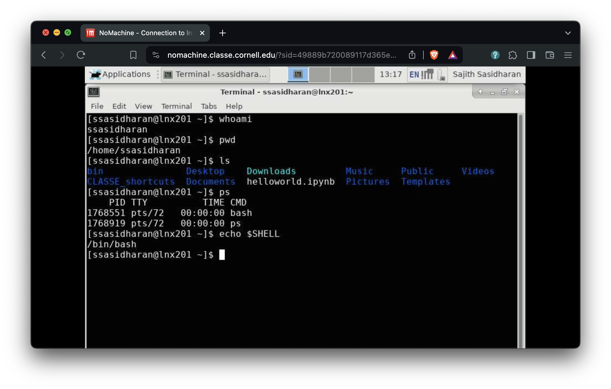
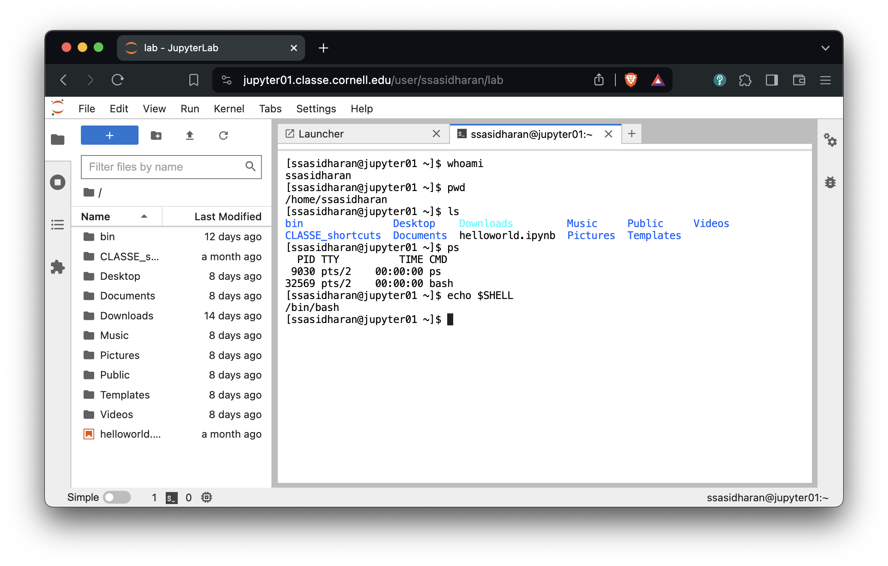
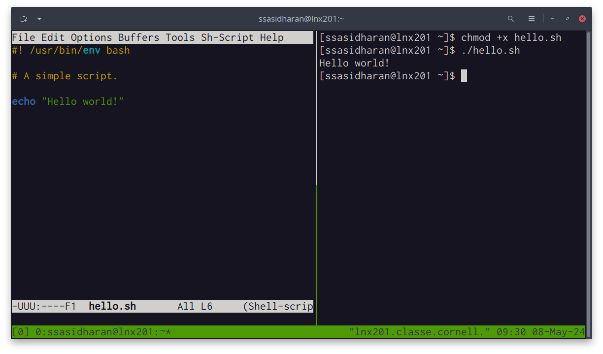

# Preliminaries

Getting into CLASSE Linux systems

## Assumptions

- You have your CLASSE accounts set up.
  - Talk to CLASSE staff otherwise!

- Options:

  - Use ssh
  - Use NoMachine
  - Use JupyterLab


## Use SSH


`ssh ${username}@lnx201.classe.cornell.edu`


## Use NoMachine



<https://wiki.classe.cornell.edu/Computing/NoMachine>


## Use JupyterLab



<https://jupyter01.classe.cornell.edu/>


# Linux, command line, etc.

## Linux

- A popular operating system.
  - (Actually an OS kernel, plus userland from various other projects.
    But those are details...)
- Unix-like, which traces back to 1969, therefore has accumulated
  quirks.
  - Expect "hysterical raisins".

## `lnx201`

- The Linux host we'll be using is `lnx201.classe.cornell.edu`.
- Runs a **distribution** called Scientific Linux.
- Good enough for general use.
- Do not run anything resource heavy on `lnx201`.


## The command line


- You will type **commands** in a **shell**, hint
   key, and then things happen.
  
  <!-- - All of this is a text user interface. -->
  <!-- - As opposed to clicking on GUI widgets. -->

## Commands

- Commands are either **programs** or **shell builtins**.
- Use one of these commands to read documentation:

  - `man ${command}`
  - `info ${command}`
  - or `${command} --help` (sometimes!)

## The shell

- A program that accepts commands, and passes those commands to the OS
  to execute.
- A popular shell is `bash`, which is the default on `lnx201`.


## Bash

- "Bourne-again shell" 
  - Based on an earlier Bourne shell, thus the "again".
  - Developed by the [GNU project][gnu].
  - On `lnx201`, `/bin/bash` is the program.
- For documentation: `info bash` or `man bash`.

[gnu]: http://gnu.org/


## Environment variables

# Files and directories

Unix slogan: Everything is a file!


## Directory navigation

```{.bash}
[ssasidharan@lnx201 ~]$ tree -d -L 1 /
/
├── bin -> usr/bin
├── boot
├── cdat
├── cifs
├── cvmfs
├── dev
├── etc
├── home
├── lib -> usr/lib
├── lib64 -> usr/lib64
├── media
├── misc
├── mnt
├── net
├── nfs
├── opt
├── proc
├── root
├── run
├── sbin -> usr/sbin
├── srv
├── sys
├── tmp
├── usr
└── var

25 directories
```

## Your home directory

- You have a "home" directory.
- Usually `/home/$USER`
   - Also `$HOME`
- You can write your files and create directories here.

<!--

   - Don't write too much when on `lnx201` though...

TODO: double check with werner

## your home directory on `lnx201`

-->


## The current working directory

"Wherever you go, there you are"

- At any time in the shell, you are "inside" a single directory,
  called the **current working directory**. 
- When you log in, your current work will be `/home/${username}`.
- You will use `cd` (change directory) to move around.
- Use the command `pwd` to find where you are.  


## Fun facts about file names

- Names that begin with "." are "hidden".
  - Omitted from directory listing when you do `ls`.
- File and directory names are case sensitive.
  - (Depends on filesystem, but that is a detail.)
- Better to avoid spaces in file names, because they are a hassle.
  - Use `_` (underscore character) instead (example: `file_name`), or
    CamelCase (example: `FileName`).

## Wildcards

Some characters are given special treatment:

- `*` matches any set of characters.


```{.bash}
[ssasidharan@lnx201 ~]$ ls /usr/bin/ab*
/usr/bin/ab  /usr/bin/abs2rel
```

- `?` matches any one character.

```{.bash}
[ssasidharan@lnx201 ~]$ ls /usr/bin/?abc*
/usr/bin/kabc2mutt  /usr/bin/kabcclient
```


## Standard input, output, and error

## I/O redirection

## Pipes

## Symbolic links

# Users and Groups

## Permissions and ownership

## Changing permissions


# Processes

## Background and foreground processes

## Terminating processes

## Signals

# Shell Scripting

# Other tools of the trade

## Text editors

Many choices! Use:

- Emacs
- Vim
- Nano
- JupyterLab


## Terminal multiplexers




# Shell scripts

## Hello world!

```{.bash filename=hello.sh code-line-numbers="true"}
#! /bin/bash

# A simple script.

echo "Hello $USER!"
```

- Make the thing executable with `chmod +x hello.sh`
- Run the thing with `./hello.sh`

## Other things

Bash supports a programming language with:

- Conditionals (with `if` statements)
- Loops (with `for` and `while` statements)
- Et cetera
- Take a peek at `/etc/bashrc` for a taste

BUT

- This is another topic, not really in scope of this presentation
- We're likely out of time anyway


# Some resources


