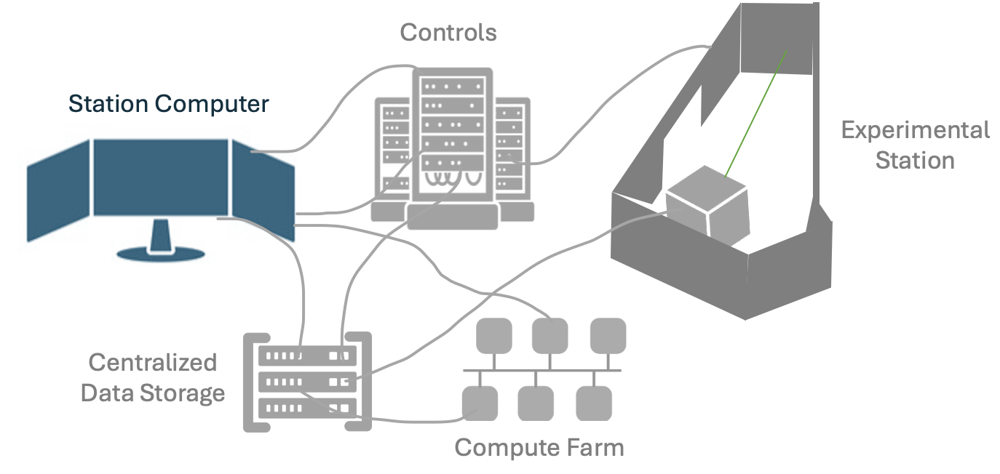
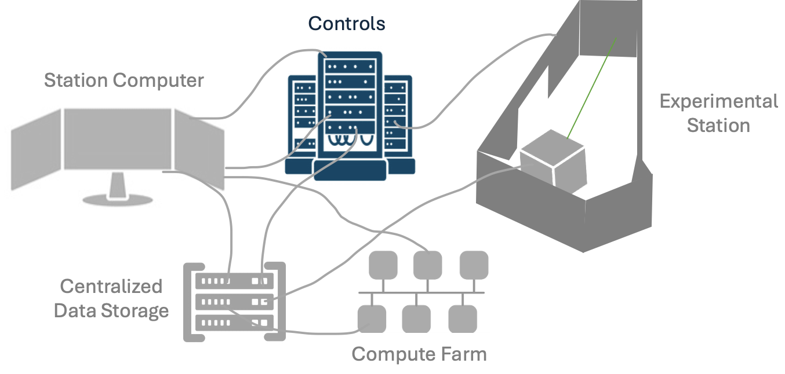
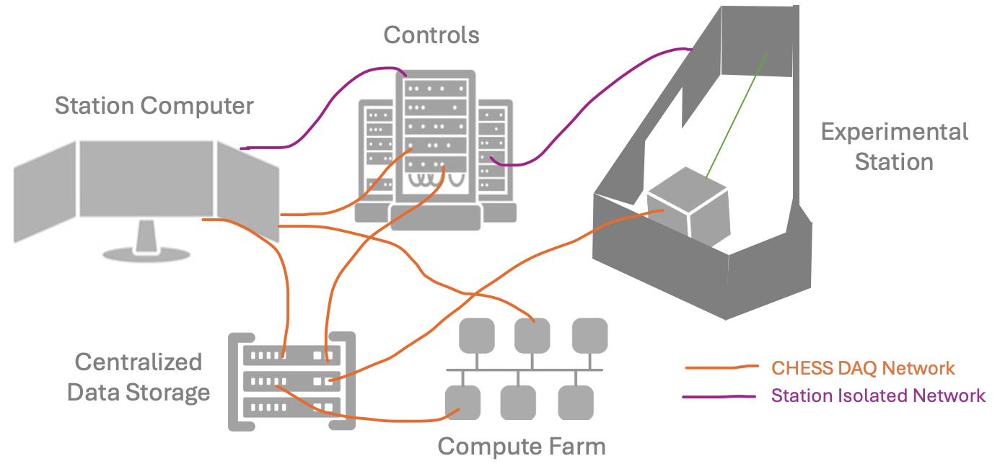
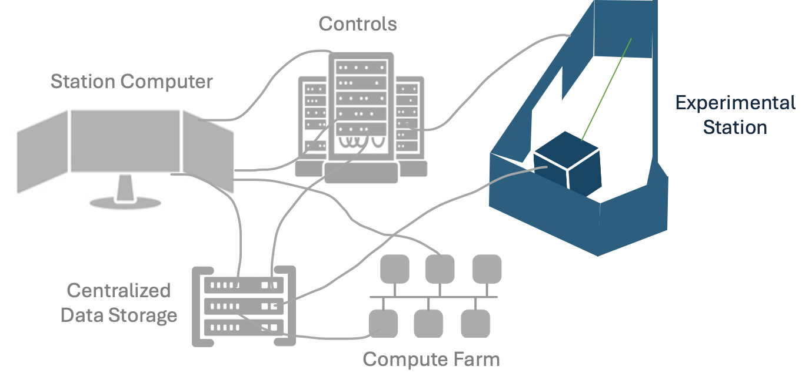
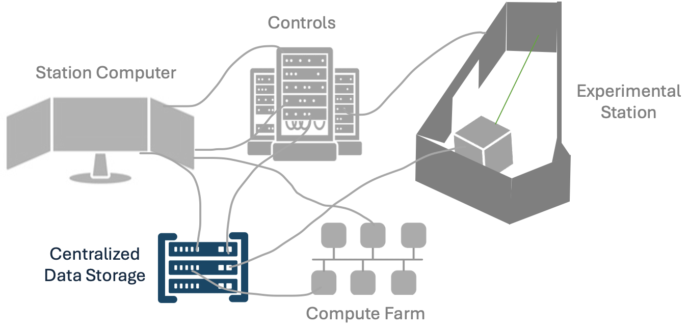
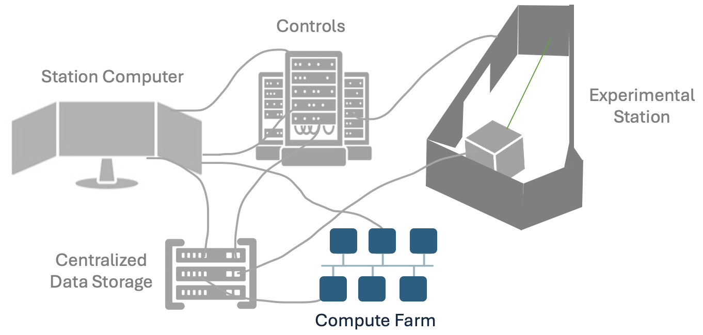
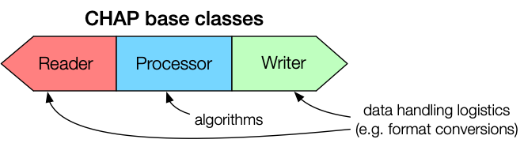
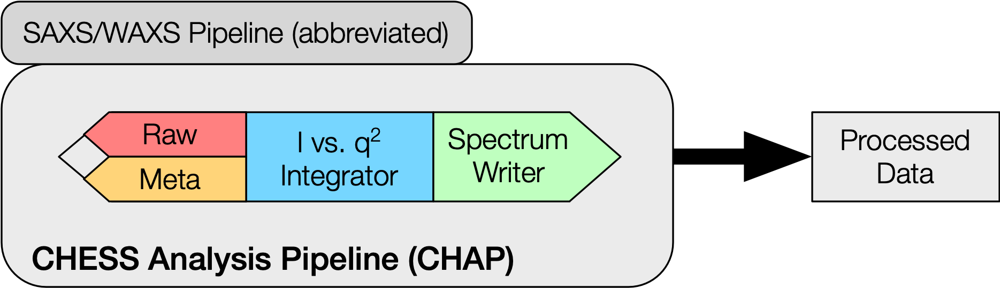

# Data Collection, Preparing Input Parameters, SPEC and CLI

# Cyberinfrastructure for Data Collection

## CHESS Experimental Stations

Data collection at all the CHESS experimental stations is supported by a complex controls, software, hardware, and cyberinfrastructure ecosystem. Having a basic understanding of this system and some relevant computing and software literacy will help prepare you for your beamtime. Historically, we have performed these trainings on the day of arrival, but preparation ahead of the beamtime will allow you to be more engaged with decisions on *your experiment* and focus on producing the highest quality experiment with your allocated beamtime. 

The Cornell High Energy Synchrotron Source (CHESS) is currently home to 7 experimental stations spanning 3 sub-facilities. The diverse science, techniques, and missions of each beamline program leads to heterogeneous landscape of data collection experiences and computing literacy needed for each user. This training will cover the commonalities of CHESS data collection and resources to leverage, as well as where to expect to expect differences across beamlines and what questions to ask. 

## Anatomy of an experiment

*insert experiment timeline* ADD: emphasize some experiments start months before the beamtime, some start at the beamtime, etc. ADD: Section on expectations for planning is beamline/technique specfic. Includes everything from software trainings, input data points, scan strategies, to bringing your device/equipment to the beamtime - record keeping and provenance of data typically starts before the beamtime. 

What is the users responsibility to record and what is CHESS's responsibility. 

*insert image of "station computer" connected to "controls racks" connected to "experimental hutch" connected to DAQ and File system and Compute Farm* 

#### Station Computer : Beamline Control Central

Every experimental station has a **station computer** that acts as controls central. The **station computer** typically runs a number of processes and is responsible for orchestrating data collection, motor motions, synchronized triggers, metadata logging, and more. 

**Station Computer** ground rules: 

- Most users directly interact with the station computer. Users associated with the beamtime will have permission to log directly into the station computer remotely through No Machine (LINK to CLASSE). Your beamline scientist will be training you in how to run *your* experiment - pay close attention and take ownership of your role during your beamtime. Your beamline scientist may only be training your group at a specific time(s) during the beamtime - make sure all users can be present during this training and/or take notes and be prepared to train your fellow users on the basic operations. When in doubt, always communicate with your staff scientist. Some processes staff scientists will insist that the user be trained by the scientist and not a fellow user. 

- The station computer is running *many* processes that enable your experiment to run. You will be asked to interact with specific processes during your beamtime. It is imperative you ONLY interact with the processes that your beamline scientist has given you permission to run. Some UI's and data reduction processes will be running on other computers through terminals on the station computer - accidentally running these processes on the station computer itself may disrupt data collection, overwhelm the station computer, or even cause it to freeze or shut down.

- The station computer has many special permissions, for instance it is able to *write* to the the CHESS DAQ (**raw** directory). When saving files such as beamtime notes, it is important to save these in the directories prescribed by your beamline scientist. (link to later section on CHESS file system and directories)

*insert image of annotated "station computer" screen that has many many windows opened with difference processes for data collection*

This is an example of a station computer screen shot with many processes. There are 4 desktops on the station computer, each with windows spanning 4 screens. This image is of the first desktop and shows a main controls terminal (SPEC), controls screens (MEDM screens), a data reduction GUI (HEXRD), realtime DIC (running from Python shell on external computer), a LabVIEW log of metadata signals from the instrument in the hutch, and many more. 

Every beamline will have a unique version of this computer - some techniques even may be executed exclusively through a GUI. 

#### Controls Hardware, Software, and Signal Monitoring

This section will discuss the hardware connections, motor configurations, and overall connectivity of signals being tracked in the beamline. 

*insert image of "station computer" connected to "controls racks" connected to "experimental hutch" connected to DAQ and File system and Compute Farm - this time the image is highlighting the connections to the hardware pieces* 

#### Controls Software 

ADD: Preamble here about controls software-  Include the difference between SPEC and EPICS. You can control Epics Devices from SPEC. 

**SPEC**

Introduce SPEC as the main controls for many beamlines. 
Give examples of standard SPEC commands that will be used. Importantly, only ever use SPEC or edit Macros with the explicit permission of your staff scientist. This may vary from beamline to beamline
SPEC commands continued. 

*mention spec built in functionality & spec.log files* 

*insert gif/video screen grab of operating SPEC* 

**EPICS**

ADD: Epics will cover drivers and PVs. 

Introduce EPICS as the drivers for many of the detectors and instrumentation in the lab
Show example of EPICS drivers. You may or may not be expected to interact with these drivers at your beamline

Many important metadata signals can also be tracked using "EPICS PVs." While many of these PVs are used throughout data collection, they can also be an important part of data monitoring. Your beamline scientist may have you observe the monitoring page depending on your experiments sensitivity to certain signals to monitor specific station signals (link to signals.chess.cornell.edu). 

*insert image of an epics MEDM for detector example*

**PYMCA**

*insert image of pymca* A common GUI used at the beamline is the PyMCA GUI. In addition to it's original use for XRF, this GUI can be used to load in spec.log data and plot the counters at your beamline. 

*gif/video of opening a spec.log, plotting counters, and fitting a function to the plot* 

**Python, MATLAB, etc.**

You may have specific other software: Python scripts (link to python tutorial), other UI’s for instrumentation, that you should receive training from your beamline scientist. See Python module if that is important.

## Networks and Filesystems

*insert image of "station computer" connected to "controls racks" connected to "experimental hutch" connected to DAQ and File system and Compute Farm - this time the image is highlighting the connection to the DAQ* 

The primary networks at the experimental stations are:
- CHESS-DAQ Network
- Isolated Station Network
- CHESS Public 
- CLASSE Public

During data collection, raw data is written directly to the **CHESS-DAQ** filesystems. The CHESS-DAQ consists of approximately 2 petabytes of dedicated online storage arrays connected to the CHESS experimental stations through a high-speed 10Gb data collection network.

To protect the communication signals between the station computer, experimental station equipment, and other local systems, each experimental station has an isolated network with direct connections. 

Detectors often have direct fiber optic / high speed data lines to inline computing resources and/or the CHESS-DAQ. 

CHESS filesystem overview and where data is saved. 

#### Detectors and Data Handling

If you wish to move any data from the CHESS filesystem to another location, the preferred way of doing so is through Globus. Please see here (LINK CHESS computing) for directions on ways to transfer data from the CHESS filesystem. 

Your beamline may be producing very large quantities of data. Due to it's size, you may not be able to take your data home or transfer it home via globus. your data in raw may only stay in hot storage for a short amount of time (6 months). Your experimental station will have best practices for how to compress or reduce this data so that it is small enough to take home or live in a different part of our filesystem. 

All data is currently saved at CHESS. The data that is living in cold storage can be restored to hot storage if needed - the process for this is located here (LINK CHESS Computing). 

#### Bring Your Own Device (BYOD)

Because the CHESS-DAQ filesystems are a critical resource for data collection, *write access* is only granted to registered devices on the CHESS-DAQ network. If you wish to bring your own device to write data to the CHESS-DAQ, please discuss your needs with your staff scientist at least one month before your beamtime. Before your device can be registered on the CHESS-DAQ, it must undergo a cybersecurity evaluation by CLASSE-IT.

*Read access* to the CHESS-DAQ filesystem may be obtained by registering your device for the LNS Protected network using [this request form](https://wiki.classe.cornell.edu/Computing/LaptopRegistration).

#### MetaData Handling

Metadata Considerations: 
There will be many parallel datastreams being collected - critical to interpreting your data. These may be located in many different locations. Introduce EPICS IOCs, spec.logs, other files. These will be critical to your data reduction. 

#### On-the-fly Data Processing & Visualization

Need to be looking at your data as it is coming off for data fidelity. Few ways this is facilitated : Introduce programs that are commonly used
Small plug for NSDF and on the fly monitoring efforts
Some beamlines are doing in-line processing > include firmware, software etc. Your data is being processed on the fly - it is important to understand what is being done and why on your behalf. This is heterogeneous across the beamlines. Overtime we will build out station specific training on these, for now it is the responsibility of the user to work with their beamline scientist and read any requisite materials they provide. 

#### Data Reduction and Analysis 

**Compute Farm**

The CLASSE Compute Farm is a central resource consisting of approximately 60 enterprise-class Linux nodes (with around 400 cores), with a front-end queueing system (Son of Grid Engine, or SGE) that distributes jobs across the Compute Farm nodes. SGE supports interactive, batch, parallel, and GPU jobs, and it ensures equitable access to the Compute Farm for all users.

Data on the CHESS-DAQ filesystems can be directly accessed using the Compute Farm, and instructions for job submission are [available here](https://wiki.classe.cornell.edu/Computing/ComputeFarmIntro).

**CHESS Analysis Pipeline (CHAP)**

The CHESS Analysis Pipeline (CHAP) is an object-oriented framework for organizing data analysis code into reusable modules. The most basic pipeline consists of the following modules:
- Reader: takes an input file or data source and converts it into a standard data structure
- Processor: takes a data structure from a Reader, executes a data processing algorithm, and writes an output data structure
- Writer: takes a data structure from a Processor and converts it to a specific file format

An example of a concrete CHAP implementation is shown below. Here, the Processor accepts inputs from multiple Readers that provide both raw data and metadata.

CHAP pipelines can be executed from a Linux command line or from the Galaxy science gateway. A third method called CHAPBook is currently under development, which presents a notebook-like coding interface for non-expert users.

**Technique/Beamline Specific Software**

#### Beamtime Notes: 

Last and potentially the most important part: It is always the responsibility of the experimenter to take DETAILED beamtime notes and a log of the data. Although work is ongoing to integrate metadata and capture requisite information in the data itself, automate workflows, visualizations, etc., it is imperative that experimenter notes are taken and ideally a copy is kept with the data on the CHESS system. 

Your beamline scientist is not responsible for memorizing the history of your data collected. They see so many experiments, if you ask 2 years later if they rememeber what *you* did - good luck. 

Example Problem: 
- End Walk through a version of taking and collecting a dataset that will be done in the hands-on portion in the afternoon. 
