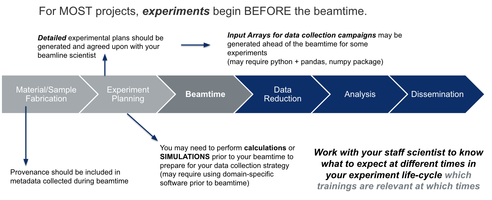
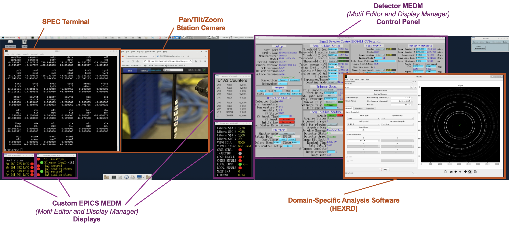
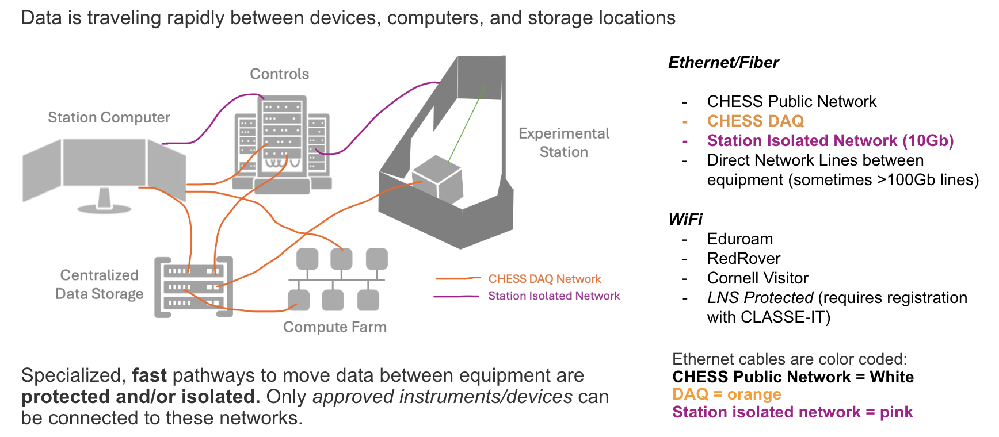
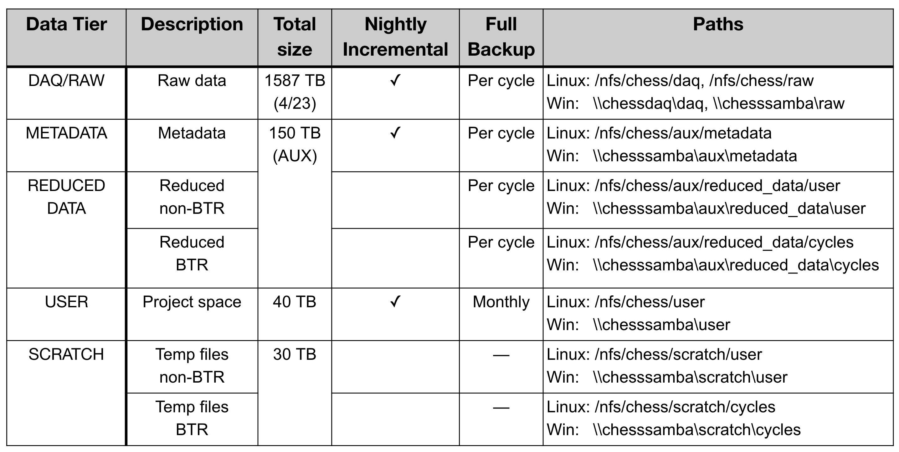
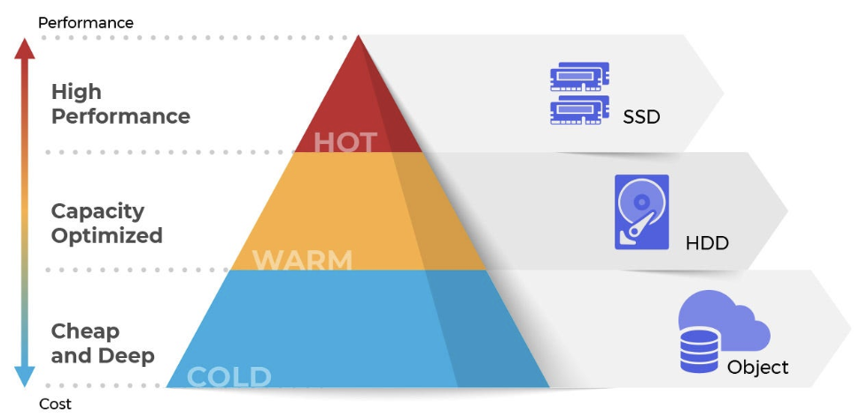
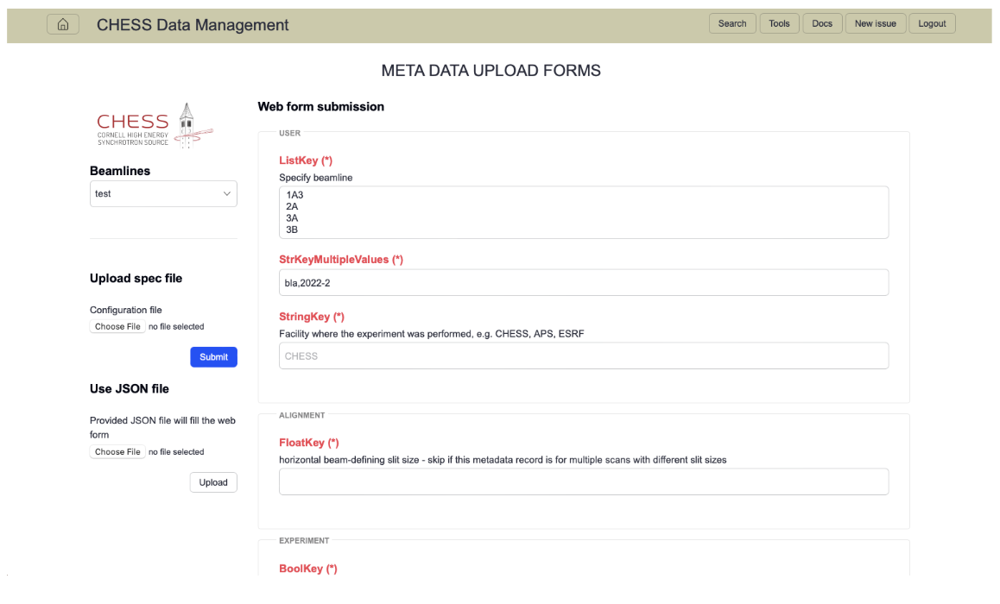

# Data Collection, Preparing Input Parameters, SPEC and CLI

# Cyberinfrastructure for Data Collection

## CHESS Experimental Stations

Data collection at all the CHESS experimental stations is supported by a complex controls, software, hardware, and cyberinfrastructure ecosystem. Having a basic understanding of this system and some relevant computing and software literacy will help prepare you for your beamtime. Historically, we have performed these trainings on the day of arrival, but preparation ahead of the beamtime will allow you to be more engaged with decisions on *your experiment* and focus on producing the highest quality experiment with your allocated beamtime. 

The Cornell High Energy Synchrotron Source (CHESS) is currently home to 7 experimental stations spanning 3 sub-facilities. The diverse science, techniques, and missions of each beamline program leads to heterogeneous landscape of data collection experiences and computing literacy needed for each user. This training will cover the commonalities of CHESS data collection and resources to leverage, as well as where to expect to expect differences across beamlines and what questions to ask. 

## Anatomy of an experiment

Most experiments start well in advance of the awarded beamtime - and so does the computing and cyber-infrastructure needs. 

While CHESS provides state-of-the-art hardware, software, computing resources and trainings, **users are responsible for the integrity of their experiment** through thoughtful planning, experimental execution, and **data handling and analysis**. This includes maintaining best practices in experimental logs, metadata tracking, and recording of researcher decisions. Due to the nature of synchrotron experiments, the data integrity and intepretabilty - even within one research group - will be dependent on the practices adpoted by the research group. 

### Beamtime Notes and Experimental Logbook: 

It is always the responsibility of the experimenter to take **detailed** beamtime notes and a log of the data. Although work is ongoing to integrate metadata and capture requisite information in the data itself, automate workflows, visualizations, etc., it is imperative that experimenter notes are taken and ideally a copy is kept with the data on the CHESS system. 

**Joint Experimenter Notes**

Often you will have a team of researchers taking data together - it is typically best practice to keep a *collaborative* log. In addition to your team - you should share these notes with your beamline scientist - they can often provide useful details you may miss if they observe some important or irregular behavior about the instrument itself that may or may not be obvious from the metadata streams. 

Remember - your beamline scientist is not responsible for memorizing the history of your data collected. They see so many experiments, if you ask 2 years later if they rememeber what *you* did - good luck. 

For recording notes during the beamtime, we recommend using plain text or Markdown language (formatted text file) because it is easy to read in many systems, rather than a Microsoft Word Document which has a proprietary format. Images can be rendered in markdown formats. 

**Co-Locate Your Beamtime Notes with Data**

Save your beamtime notes or a copy of your beamtime notes or (link to your google doc / equivalent) on the CHESS filesystem with your data (your beamline scientist will tell you where the best place is). 

**Leverage MetaData Services**

Whenever possible, we encourage users to leverage the metadata services, beamline-specific software strategies (e.g. adding metadata to image frame headers), piping unique signals through software or hardware signals - saving these metadata *with* the data at the time of data collection. For unique aspects of your experiment, it is important to identify useful metadata to have associated with the x-ray data *ahead* of the beamtime. If signals are required to be monitored, this may need to be arranged for two weeks in advanced (see Bring Your Own Device ([BYOD](#bring-your-own-device-byod)). 

**Commenting Software**

Comment any code produced at the beamtime. *If this code was used to make decisions about the experiment, it should be saved and referred to in your experimental log.*

### Station Computer : Beamline Control Central

Every experimental station has a **station computer** that acts as controls central. The **station computer** typically runs a number of processes and is responsible for orchestrating data collection, motor motions, synchronized triggers, metadata logging, and more. 

**Station Computer** ground rules: 

- Most users directly interact with the station computer. Users associated with the beamtime will have permission to log directly into the station computer remotely through No Machine (LINK to CLASSE). Your beamline scientist will be training you in how to run *your* experiment - pay close attention and take ownership of your role during your beamtime. Your beamline scientist may only be training your group at a specific time(s) during the beamtime - make sure all users can be present during this training and/or take notes and be prepared to train your fellow users on the basic operations. When in doubt, always communicate with your staff scientist. Some processes staff scientists will insist that the user be trained by the scientist and not a fellow user. 

- The station computer is running *many* processes that enable your experiment to run. You will be asked to interact with specific processes during your beamtime. It is imperative you ONLY interact with the processes that your beamline scientist has given you permission to run. Some UI's and data reduction processes will be running on other computers through terminals on the station computer - accidentally running these processes on the station computer itself may disrupt data collection, overwhelm the station computer, or even cause it to freeze or shut down.

- The station computer has many special permissions, for instance it is able to *write* to the the CHESS DAQ (**raw** directory). When saving files such as beamtime notes, it is important to save these in the directories prescribed by your beamline scientist. (link to later section on CHESS file system and directories)

 

This is an example of a station computer screen shot with many processes. There are 4 desktops on the station computer, each with windows spanning 4 screens. This image is of the first desktop and shows a main controls terminal (SPEC), controls screens (MEDM screens), a data reduction GUI (HEXRD). There will typically be even more processes running than this. 

Every beamline will have a unique version of this computer - some techniques even may be executed exclusively through a GUI. 

###1 Controls Hardware, Software, and Signal Monitoring

This section will discuss the hardware connections, motor configurations, and overall connectivity of signals being tracked in the beamline. 

#### Controls Software 

There are many controls languages and strategies across the lab. The two most common cases are **SPEC** and **EPICS** which will briefly be introduced here. Python-based controls are also very common. 

**SPEC**

SPEC is a language, loosely based on C, used for instrument control and data acquisition at many synchrotrons. 

When using spec, you will interact with a SPEC terminal and run a combination of “standard” SPEC commands and/or a series of compiled programs for your technique 

Importantly, only ever use SPEC or edit Macros with the explicit permission of your staff scientist. This may vary from beamline to beamline
SPEC commands continued. 

Below is a video of a SPEC command window with built-in and custom macros. 

<video width="700" controls> <source src="./xs100-figures/XCITE_SPEC.mp4" type="video/mp4"></video>

**EPICS**

EPICS is a set of software tools and applications which provide a software infrastructure for use in building distributed control systems to operate devices 

Many of the devices at CHESS leverage EPICS drivers for operation EPICS PVs (process variables) are commonly used for signal monitoring and metadata/data logging.  

Many important metadata signals can also be tracked using "EPICS PVs." While many of these PVs (process variables) are used throughout data collection, they can also be an important part of data monitoring. Your beamline scientist may have you observe the monitoring page depending on your experiments sensitivity to certain signals to monitor specific station signals (link to signals.chess.cornell.edu). 

An Epics MEDM (Motif Editor and Display Manager) Screen for a Detector is shown in the annotated station view.  

**PYMCA**

A common GUI used at the beamline is the PyMCA GUI. In addition to it's original use for XRF, this GUI can be used to load in spec.log data and plot the counters at your beamline. 

**Python, MATLAB, etc.**

You may have specific other software: Python scripts (link to python tutorial), other UI’s for instrumentation, that you should receive training from your beamline scientist. See Python module if that is important.

## Networks and Filesystems

During data collection, raw data is written directly to the **CHESS-DAQ** filesystems. The CHESS-DAQ consists of approximately 2 petabytes of dedicated online storage arrays connected to the CHESS experimental stations through a high-speed 10Gb data collection network.

To protect the communication signals between the station computer, experimental station equipment, and other local systems, each experimental station has an isolated network with direct connections. 

Detectors often have direct fiber optic / high speed data lines to inline computing resources and/or the CHESS-DAQ. 

The CHESS filesystem has different locations for storing raw data, reduced data, etc. These different locations have different backup schedules and total storage amounts. Typically best practice is as follows: 
1. Raw Data that cannot be reproduced is located in RAW/DAQ
2. Reduced Data that *can* be reproduced from Raw Data/Other Protected Data is in REDUCED DATA
3. Metadata that is small and not reproducible should be saved in METADATA (backed up nightly)
4. Data that is being produced and does not need to be backed up and could be processed again should be done in SCRATCH. This is a good location for testing code before performing Data Reduction. 
5. For Data NOT associated with a particular beamtime, USER is an appropriate place for these projects. 

### Protected Data: Intellectual Property (IP) and Export Control

Some data needs to be protected, e.g. data covered under Intellectual Property or Export Control agreements

All such data must be declared and all agreements signed before ANY data is on CHESS/Cornell computing systems (including preparatory material that falls under IP or Export Control categories). 

Data Collection, Storage, and Analysis can be customized to comply with data agreements, including: 
- Modifying isolated networks
- Mounting encrypted drives
- Configuring encrypted computers
- Modifying permissions on filesystem locations
- Securing the experimental station with an entry password
- Disconnecting streaming video to the experimental station

### Detectors and Data Handling

If you wish to move any data from the CHESS filesystem to another location, the preferred way of doing so is through Globus. Please see here (https://wiki.classe.cornell.edu/Computing/GlobusDataTransfer) for directions on ways to transfer data from the CHESS filesystem. 

Your beamline may be producing very large quantities of data. Due to it's size, you may not be able to take your data home or transfer it home via globus. your data in raw may only stay in hot storage for a short amount of time (6 months). Your experimental station will have best practices for how to compress or reduce this data so that it is small enough to take home or live in a different part of our filesystem. 

The data is still saved, but to transfer or perform analysis on the files you will need to arrange to have it rolled back into “hot storage” - AKA take out an IT ticket: https://wiki.classe.cornell.edu/Computing/ServiceRequestTips  

### Bring Your Own Device (BYOD)

Users may need to bring their own devices to be beamline - either physically in the lab or remotely connected to the CHESS networks 

Examples include:
- Controls computer for equipment they have integrated for an experiment
- Analysis computer for on-the-fly analysis

All devices must be approved at least two weeks in advance. It may not be possible to consider integration on a shorter time period.

Because the CHESS-DAQ filesystems are a critical resource for data collection, *write access* is only granted to registered devices on the CHESS-DAQ network. If you wish to bring your own device to write data to the CHESS-DAQ, please discuss your needs with your staff scientist at least one month before your beamtime. Before your device can be registered on the CHESS-DAQ, it must undergo a cybersecurity evaluation by CLASSE-IT.

*Read access* to the CHESS-DAQ filesystem may be obtained by registering your device for the LNS Protected network using [this request form](https://wiki.classe.cornell.edu/Computing/LaptopRegistration).

### MetaData Handling

Ideally, all the data necessary to **fully reproduce your results** are recorded and disseminated in a manner that others can interpret after your experiment. Ideally the provenance remains unbroken from experiment planning.

Metadata and parallel data streams are generated at every stage of your experiment. CHESS is continuing to develop and implement services to help with this creation. From programs like Galaxy, to our Metadata service - 

The **metadata service** (https://wiki.classe.cornell.edu/bin/viewauth/CHESS/Private/CHESSMetadataService) provides tools to record and automatically ingest machine-readable metadata in a systematic way. It includes variables that historically were not recorded via a second data stream (e.g. the material processing parameters).

### On-the-fly Data Processing & Visualization

Need to be looking at your data as it is coming off for data fidelity. At some beamlines, you will need to interact manually with a GUI to render your images and make sure the data quality is what you are expecting. At some beamlines, the new NSDF (National Data Science Fabric) Dashboard has been deployed for some datatypes which allows interactive visualization of data as it is coming off the beamline. An example can be found here:  https://services.nationalsciencedatafabric.org/chess/. 

Many beamlines have an initial “data reduction” procedure that reduces the size of the data through compression or on-the-fly analysis to have smaller file sizes that are more manageable to analyze at your home institution. 

Some of these processes are software procedures performed on the data after it is written to the raw directory, while other beamlines utilize inline data processing/compression prior to writing their files to the raw directory. Overtime we will build out station specific training on these, for now it is the responsibility of the user to work with their beamline scientist and read any requisite materials they provide. 

### Data Reduction and Analysis 

**Compute Farm**

The CLASSE Compute Farm is a central resource consisting of approximately 60 enterprise-class Linux nodes (with around 400 cores), with a front-end queueing system (Son of Grid Engine, or SGE) that distributes jobs across the Compute Farm nodes. SGE supports interactive, batch, parallel, and GPU jobs, and it ensures equitable access to the Compute Farm for all users.

Data on the CHESS-DAQ filesystems can be directly accessed using the Compute Farm, and instructions for job submission are [available here](https://wiki.classe.cornell.edu/Computing/ComputeFarmIntro).

**CHESS Analysis Pipeline (CHAP)**

The CHESS Analysis Pipeline (CHAP) is an object-oriented framework for organizing data analysis code into reusable modules. The most basic pipeline consists of the following modules:
- Reader: takes an input file or data source and converts it into a standard data structure
- Processor: takes a data structure from a Reader, executes a data processing algorithm, and writes an output data structure
- Writer: takes a data structure from a Processor and converts it to a specific file format

An example of a concrete CHAP implementation is shown below. Here, the Processor accepts inputs from multiple Readers that provide both raw data and metadata.

CHAP pipelines can be executed from a Linux command line or from the Galaxy science gateway. A third method called CHAPBook is currently under development, which presents a notebook-like coding interface for non-expert users.

**Technique/Beamline Specific Software**

CHESS has many common X-ray software packages available on the system. 
Speak with your beamline scientist for the preferred software package for your experiment.
